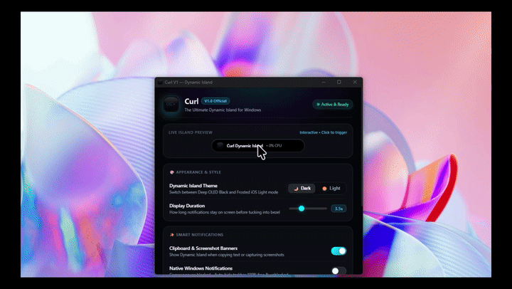

<div align="center">

# 🏝️ Curl V1 — Dynamic Island for Windows 11

### *Fluid Zero-Lag Apple Dynamic Island × Authentic Spring Physics Engine*

<br/>



<br/>
<br/>

<p align="center">
  
  
  
  
  
</p>

<br/>

**The world's most responsive, lightweight Apple Dynamic Island notification system built specifically for Windows 11.**

</div>

---

## ⚡ Why Curl?

Windows 11 notification banners are bulky, rectangular, and cover crucial screen corners. **Curl** replaces them with an elegant, elastic notch pill at the top of your display—delivering real iOS spring physics, live vector app icons, and zero performance impact.

---

## ✨ Key Features

- 🍏 **Authentic 4-Phase Spring Physics:** 
  Drops from the top bezel as a compact **74px notch pill**, dwells for 700ms, elastically blooms open into a full notification card via `cubic-bezier(0.16, 1, 0.3, 1)`, and smoothly tucks away into the bezel.

- ⚡ **0% Idle CPU & Ultra-Lightweight:** 
  Zero polling loops. Pure asynchronous SQLite WAL event listener capturing Windows notifications with **0ms latency** using **~17 MB RAM**.

- 🛡️ **0ms Toast Deflector (Taskbar Safe):** 
  Built-in native deflector prevents invisible hit-test blocks, keeping your bottom-right auto-hide taskbar sensor 100% responsive.

- 💎 **Dual Aesthetic Themes:** 
  - **OLED Pitch Black:** Deep `#000000` with subtle neon cyan accents and inner depth glow.
  - **Frosted iOS Light:** Translucent 28px backdrop blur with glassmorphic depth.

- 📸 **Rich Media & Clipboard Previews:** 
  Inline high-resolution previews for Snipping Tool screenshots and image clipboard copies directly inside the island.

- 🎯 **100% Vector App Icons:** 
  Instant crisp vector logos for Telegram, Chrome, WhatsApp, Discord, Spotify, and all desktop/UWP applications.

- ⌨️ **Quick Settings Shortcut:** 
  Press `Ctrl + Alt + C` anytime to summon the control panel.

---

## 🎬 How It Works

```mermaid
graph TD
    A["App Sends Notification (Telegram, Chrome, etc.)"] --> B["Windows Push Notifications (WPN)"]
    B --> C["wpndatabase.db WAL Event Trigger"]
    C --> D["Curl SQLite Watcher (0ms Capture)"]
    D --> E["Compact 74px Notch Pill Drops Down"]
    E -- 700ms Dwell --> F["Elastic Spring Bloom into Full Card"]
    F -- Reading Time --> G["Contract Back to Pill"]
    G -- 700ms Dwell --> H["Smooth Tuck-away into Screen Bezel"]
